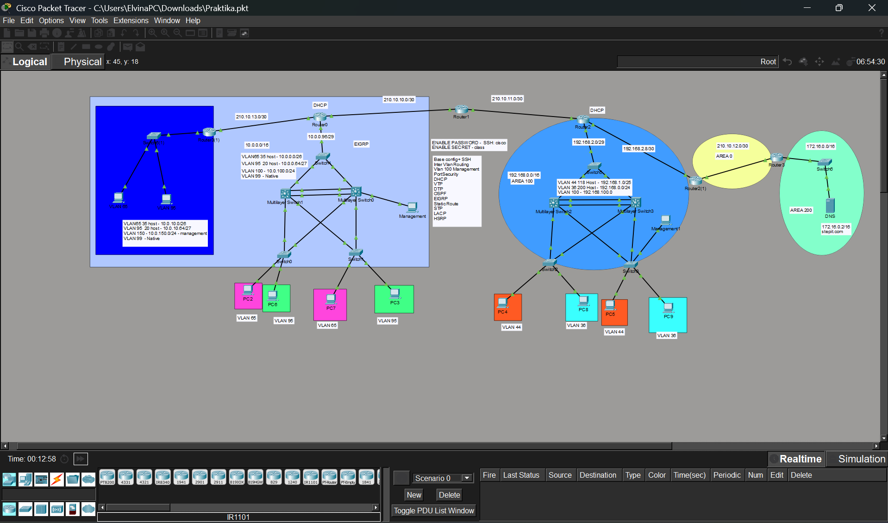

# Cisco Packet Tracer Routing Redistribution Lab

This project is a Cisco Packet Tracer network lab that demonstrates VLAN segmentation, dynamic routing, route redistribution, DHCP, redundancy, and basic network services.

## Technologies Used

- VLANs
- Inter-VLAN Routing
- DHCP
- OSPF
- EIGRP
- Route redistribution between EIGRP and OSPF
- Static Routing
- HSRP
- SSH
- Port Security
- EtherChannel / LACP
- DNS Server
- ACLs

## Topology



## Network Overview

The topology consists of multiple routed domains using both EIGRP and OSPF. Route redistribution is configured between EIGRP and OSPF to provide end-to-end connectivity between different network areas.

The lab includes routers, multilayer switches, access switches, VLANs, client PCs, management hosts, and a DNS server.

## Routing

This lab uses both EIGRP and OSPF routing domains.

Routing features include:

- EIGRP routing domain
- OSPF multi-area routing
- Route redistribution between EIGRP and OSPF
- Static route integration
- End-to-end connectivity between different network segments

## Switching

Switching features include:

- VLAN segmentation
- Trunk links
- Inter-VLAN routing
- EtherChannel / LACP
- HSRP gateway redundancy

## Services and Security

The lab includes:
- DHCP configuration
- DNS server configuration
- SSH remote access
- Port Security
- Access Control Lists
- Basic device hardening
## Verification Commands

Useful commands for checking the configuration:

```cisco
show ip route
show ip protocols
show ip ospf neighbor
show ip eigrp neighbors
show vlan brief
show interfaces trunk
show etherchannel summary
show standby brief
show access-lists
show running-config
```
